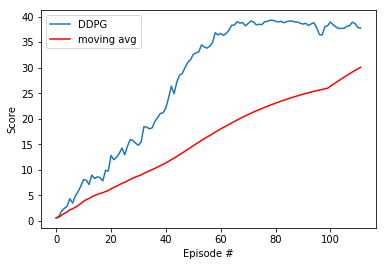

#### Udacity Deep Reinforcement Learning Nanodegree
### Project 2: Continuous Control


## Project description

### 1. Environment

In this project an agent (or several similar agent) aims to follow a target. A reward of +1 is provided for
each step that the agent’s hand is in the goal location. Thus, the goal of your agent is to maintain its position
at the target location for as many time steps as possible.
The environment space is defined by 33 variables by agent (position, rotation, velocity, and angular velocities
of the arm) and the action space contains 4 numbers corresponding to torque applicable to two joints.

### 2. Learning algorithm

The algorithm used here is a Deep Deterministic Policy Gradient (DDPG) [2]. A DDPG is composed of two
networks : one actor and one critic.

During a step, the actor is used to estimate the best action, ie argmaxaQ (s, a); the critic then use this
value as in a DDQN to evaluate the optimal action value function.

Both of the actor and the critic are composed of two networks. On local network and one target network. This
is for computation reason : during backpropagation if the same model was used to compute the target value
and the prediction, it would lead to computational difficulty.

During the training, the actor is updated by applying the chain rule to the expected return from the start
distribution. The critic is updated as in Q-learning, ie it compares the expected return of the current state to
the sum of the reward of the choosen action + the expected return of the next state.

The first structure tried was the one from the ddpg-pendulum project of the nanodegree (with few modifications) and it gave very good results. Few things had to be adapted : the step function as we know have simulteanously 20 agents that return experiences and the noise as we have to apply a different noise to every
agent (at first I did not change the noise, the training was running but the agent did not learn anything).

### The Actor-Network is shown below

     # Actor Network (w/ Target Network)
     self.actor_local = Actor(state_size, action_size, random_seed).to(device)
     self.actor_target = Actor(state_size, action_size, random_seed).to(device)
     self.actor_optimizer = optim.Adam(self.actor_local.parameters(), lr=LR_ACTOR)
    
### The Critic-Network is shown below

    # Critic Network (w/ Target Network)
    self.critic_local = Critic(state_size, action_size, random_seed).to(device)
    self.critic_target = Critic(state_size, action_size, random_seed).to(device)
    self.critic_optimizer = optim.Adam(self.critic_local.parameters(), lr=LR_CRITIC, weight_decay=WEIGHT_DECAY)
    
    
#### Gradient Clipping

Gradient clipping is a technique that tackles exploding gradients. The idea of gradient clipping is very simple: If the gradient gets too large, we rescale it to keep it small.
Initially, I added batch normalization between every layer in both the actor and critic models. However, this may have been overkill, and seemed to prolong training time. I eventually reduced the use of batch normalization to just the outputs of the first fully-connected layers of both the actor and critic models.

Gradient clipping ensures the gradient vector g has norm at most c. This helps gradient descent to have a reasonable behaviour even if the loss landscape of the model is irregular. The following figure shows an example with an extremely steep cliff in the loss landscape. Without clipping, the parameters take a huge descent step and leave the “good” region. With clipping, the descent step size is restricted and the parameters stay in the “good” region.

Note that this function is applied after the backward pass, but before the optimization step.

```python
# Compute critic loss
Q_expected = self.critic_local(states, actions)
critic_loss = F.mse_loss(Q_expected, Q_targets)
# Minimize the loss
self.critic_optimizer.zero_grad()
critic_loss.backward()
torch.nn.utils.clip_grad_norm_(self.critic_local.parameters(), 1)
self.critic_optimizer.step()
```

#### Batch Normalization

To increase the stability of a neural network, batch normalization normalizes the output of a previous activation layer by subtracting the batch mean and dividing by the batch standard deviation.

Consequently, batch normalization adds two trainable parameters to each layer, so the normalized output is multiplied by a “standard deviation” parameter (gamma) and add a “mean” parameter (beta). In other words, batch normalization lets SGD do the denormalization by changing only these two weights for each activation, instead of losing the stability of the network by changing all the weights.

```python
# actor forward pass
def forward(self, state):
    """Build an actor (policy) network that maps states -> actions."""
    x = F.relu(self.bn1(self.fc1(state)))
    x = F.relu(self.fc2(x))
    return F.tanh(self.fc3(x))
```
```python
# critic forward pass
def forward(self, state, action):
    """Build a critic (value) network that maps (state, action) pairs -> Q-values."""
    xs = F.relu(self.bn1(self.fcs1(state)))
    x = torch.cat((xs, action), dim=1)
    x = F.relu(self.fc2(x))
    return self.fc3(x)
```


### 3. Results
Once all of the various components of the algorithm were in place, my agent was able to solve the 20 agent Reacher environment. Again, the performance goal is an average reward of at least +30 over 100 episodes, and over all 20 agents.

The graph below shows the final results. The best performing agent was able to solve the environment starting with the 12th episode, with a top mean score of 39.3 in the 79th episode. The complete set of results and steps can be found in [this notebook](Continuous_Control_v8.ipynb).




##### &nbsp;

## Future Improvements
- **Experiment with other algorithms** &mdash; Tuning the DDPG algorithm required a lot of trial and error. Perhaps another algorithm such as [Trust Region Policy Optimization (TRPO)](https://arxiv.org/abs/1502.05477), [Proximal Policy Optimization (PPO)](Proximal Policy Optimization Algorithms), or [Distributed Distributional Deterministic Policy Gradients (D4PG)](https://arxiv.org/abs/1804.08617) would be more robust.
- **Add *prioritized* experience replay** &mdash; Rather than selecting experience tuples randomly, prioritized replay selects experiences based on a priority value that is correlated with the magnitude of error. This can improve learning by increasing the probability that rare and important experience vectors are sampled.

##### &nbsp;
##### &nbsp;

---
